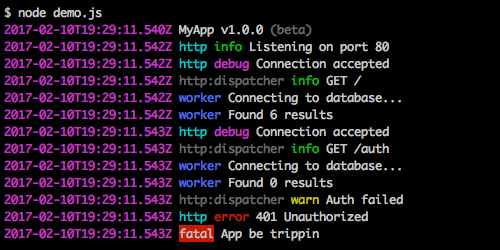

# SnoopLogg

[![NPM Version][npm-image]][npm-url]
[![NPM Downloads][downloads-image]][downloads-url]
[![Travis CI Build][travis-image]][travis-url]
[![Appveyor CI Build][appveyor-image]][appveyor-url]
[![Test Coverage][coveralls-image]][coveralls-url]
[![Deps][david-image]][david-url]
[![Dev Deps][david-dev-image]][david-dev-url]

Laid back debug logging.

## Installation

    npm install snooplogg



## Features

 * Built-in and custom log types
 * Ability to snoop on other snooplogg instances nested in dependencies
 * Pipe messages to one or more streams
 * Namespacing
 * Filter messages using the `DEBUG` (or `SNOOPLOGG`) environment variable
 * Automatic color selection with brightness range
 * Exports [chalk](https://www.npmjs.com/pacakge/chalk) library for your convenience.
 * Similar API to [TJ's debug](https://www.npmjs.com/package/debug):

## Examples

`debug` style:

```js
// app.js

import snooplogg from 'snooplogg';
import http from 'http';

// const debug = require('debug')('http');
const debug = snooplogg('http').log;
const name = 'My App';

debug('booting %o', name);

http.createServer((req, res) => {
	debug(`${req.method} ${req.url}`);
	res.end('hello\n');
}).listen(3000, () => debug('listening'));
```

```js
// worker.js

import snooplogg from 'snooplogg';

const a = snooplogg('worker:a');
const b = snooplogg('worker:b');
/*
Or you could do this:

const worker = snooplogg('worker');
const a = worker('a');
const b = worker('b');
*/

function work_a() {
  a('doing lots of uninteresting work');
  setTimeout(work_a, Math.random() * 1000);
}

work_a();

function work_b() {
	b('doing some work');
	setTimeout(work_b, Math.random() * 2000);
}

work_b();
```

Standard console usage:

```js
import log from 'snooplogg';

log.trace('bow'); // writes to stdout/stderr if DEBUG matches + all pipes

log.info('wow')
   .warn('wow')
   .error('wow');
```

Namespace support:

```js
import snooplogg from 'snooplogg';

const log = snooplogg('myapp');
log.info('bow', 'wow', 'wow'); // writes to stdout/stderr if DEBUG=myapp + all pipes
```

Stream output to stdout:

```js
import snooplogg from 'snooplogg';

const log = snooplogg.stdio('yippy yo');
log.info('bow', 'wow', 'wow'); // writes to stdout/stderr + all pipes

const log = snooplogg.enable('*')('yippy yay');
log.info('bow', 'wow', 'wow'); // writes to stdout/stderr + all pipes
```

Pipe output to a stream (such as a file or socket):

```js
import snooplogg from 'snooplogg';

const log = snooplogg
	.pipe(someWritableStream);

log.info('yippy', 'yo');
```

Listen for messages from all `SnoopLogg` instances, even from other dependencies:

```js
import snooplogg, { snoop } from 'snooplogg';

snoop();

const log = snooplogg('bumpin');

log('one');
log
  .trace('two')
  .debug('three')
  .info('and to the four');

log.warn(`It's like this`);
log.error('and like that');
log.fatal('and like this');
```

Custom log types:

```js
import snooplogg, { type } from 'snooplogg';

type('jin', { color: 'cyan' });
type('juice', { color: 'yellow' });

const log = snooplogg();

log.jin('parents ain\'t home');
log.juice('too much drama', true);
```

Console:

```js
import snooplogg from 'snooplogg';

snooplogg.enable('*').console.log('dawg gone');
```

### API

#### `snooplogg()`

Creates a namespaced logger as well as defines the global namespaced logger.

#### `snooplogg.log(msg)`

Outputs a message using the standard `console.log()` format syntax.

#### `snooplogg.config(options)`

Allows you to set various instance specific options.

* `colors` - (Array) An array of color names to choose from when auto-selecting a color,
  specifically for rendering the namespace.
* `minBrightness` - (Number) The minimum brightness to auto-select a color. Value must be between 0
  and 255 as well as less than or equal to the `maxBrightness`. Defaults to `80`.
* `maxBrightness` - (Number) The maximum brightness to auto-select a color. Value must be between 0
  and 255 as well as greater than or equal to the `minBrightness`. Defaults to `210`.
* `theme` - (String) The name of the default theme to use. Defaults to `standard`.
* `maxBufferSize` - (Number) The maximum number of log lines to buffer. Used to flush prior messages
  to new pipes.

Returns the original `SnoopLogg` instance.

### Enabling Logging

By default, Snooplogg only prints messages if the the `DEBUG` or `SNOOPLOGG` environment variables
are set.

```bash
# macOS and Linux
$ DEBUG=izzle node loggfather.js

# Windows PowerShell
> $Env:DEBUG="izzle" node loggfather.js

# Windows Command Prompt
> set DEBUG=izzle
> node loggfather.js
```

> Note: You may also use the `SNOOPLOGG` environment variable to avoid conflicts
> with other libraries that use [debug](https://www.npmjs.com/package/debug)

You can also use any environment variable you want by simply calling `enable()` before logging.

```js
import snooplogg from 'snooplogg';

// change the global environment variable name
snooplogg.enable(process.env.LOGGFATHER);
```

> Note: The console log types (`info`, `warn`, `error`, etc) are for display only. `snooplogg` does
> not support log level filtering, only namespace filtering via the `SNOOPLOGG` (or `DEBUG`)
> environment variable or by `enable()`.

### Global Defaults

SnoopLogg allows you to set defaults using environment variables that apply to all SnoopLogg
instances.

* `SNOOPLOGG_COLOR_LIST` - A comma-separated list of supported color names.
* `SNOOPLOGG_DEFAULT_THEME` - Sets the `theme`.
* `SNOOPLOGG_MAX_BUFFER_SIZE` - Sets the `maxBufferSize`.
* `SNOOPLOGG_MAX_BRIGHTNESS` - Sets the `maxBrightness`.
* `SNOOPLOGG_MIN_BRIGHTNESS` - Sets the `minBrightness`.

## License

MIT

[npm-image]: https://img.shields.io/npm/v/snooplogg.svg
[npm-url]: https://npmjs.org/package/snooplogg
[downloads-image]: https://img.shields.io/npm/dm/snooplogg.svg
[downloads-url]: https://npmjs.org/package/snooplogg
[travis-image]: https://travis-ci.org/cb1kenobi/snooplogg.svg?branch=master
[travis-url]: https://travis-ci.org/cb1kenobi/snooplogg
[appveyor-image]: https://ci.appveyor.com/api/projects/status/ecpifaqt54itg7h4?svg=true
[appveyor-url]: https://ci.appveyor.com/project/cb1kenobi/snooplogg
[coveralls-image]: https://img.shields.io/coveralls/cb1kenobi/snooplogg/master.svg
[coveralls-url]: https://coveralls.io/r/cb1kenobi/snooplogg
[david-image]: https://img.shields.io/david/cb1kenobi/snooplogg.svg
[david-url]: https://david-dm.org/cb1kenobi/snooplogg
[david-dev-image]: https://img.shields.io/david/dev/cb1kenobi/snooplogg.svg
[david-dev-url]: https://david-dm.org/cb1kenobi/snooplogg#info=devDependencies
